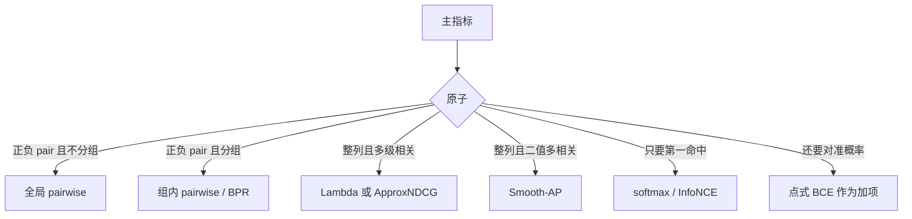

# 排序评估指标手册

AUC · GAUC · NDCG · MAP · MRR 与对应损失函数

本文只做公式推导。前半部分写五个指标：定义从何而来、离散估计量怎么写、在哪一层分组、权重加在何处、何时可用、何时失效。后半部分把每个指标对应到可反传的代理损失：为何不能直接对指标求导、代理从哪一步放宽、分组与加权如何与指标对齐。

---

## 0. 五个指标其实在回答五种不同的问题

设一次评估里每条样本带有真实相关 \(y\)（或等级 \(r\)）、预测分 \(s\)、以及分组键 \(u\)（用户、Query、请求均可）。模型把 \(s\) 大的排在前面。

五个指标问的不是同一件事：

| 指标 | 问的问题 | 比较的原子 | 是否必须分组 |
|------|----------|------------|----------------|
| AUC | 随机一个正样本是否排在随机一个负样本前面 | 正–负 pair | 否，全库混合 |
| GAUC | 在同一个 \(u\) 内部，上述 pair 问题的加权平均 | 组内 pair | 是 |
| NDCG | 从上往下看，累积到的相关增益占理想列表的几成 | 整条有序列表 | 是 |
| MAP | 每命中一个相关文档时的精度，平均有多高 | 整条有序列表 | 是 |
| MRR | 第一条相关结果平均在第几位的倒数 | 第一个命中 | 是 |

因此：AUC 涨了、NDCG 跌了，并不矛盾。前者可以来自跨组可分性，后者看的是组内位置。

下文统一约定：

- 位次 \(i=1,2,\ldots\) 从得分最高开始数；
- \(\mathbf{1}[\cdot]\) 为示性函数；
- \(n^+,n^-\) 为正、负样本个数，\(n=n^++n^-\)；
- 截断位置记为 \(K\)；不写 \(K\) 表示用完整列表；
- 某组内没有任何 \(y>0\) 时，AUC 无定义；NDCG / MAP / MRR 该组不进入平均（另报覆盖率）。把这种组记成 0 会系统性压低均值，两种口径不得混用。

---

## 1. AUC

### 1.1 连续定义：ROC 曲线下面积

固定阈值 \(\tau\)，规则 \(\hat y=\mathbf{1}[s\ge\tau]\)。真正例率与假正例率

\[
\mathrm{TPR}(\tau)=\frac{\#\{i:y_i=1,\,s_i\ge\tau\}}{n^+},\qquad
\mathrm{FPR}(\tau)=\frac{\#\{j:y_j=0,\,s_j\ge\tau\}}{n^-}.
\]

\(\tau\) 从 \(+\infty\) 连续降到 \(-\infty\)，点 \((\mathrm{FPR},\mathrm{TPR})\) 画出 ROC。定义为

\[
\mathrm{AUC}=\int_{0}^{1}\mathrm{TPR}\,\mathrm{d}(\mathrm{FPR}).
\]

AUC 与阈值无关：它不评价「0.5 该不该当门槛」，只评价序。

### 1.2 把积分拆成扫描过程

将全部样本按 \(s\) 从高到低扫描。ROC 上只会发生三种位移：

1. 遇到一个正样本：TPR 增加 \(1/n^+\)，FPR 不动。竖直线段，面积为 0。
2. 遇到一个负样本：FPR 增加 \(1/n^-\)，TPR 不动。水平线段。此时已经扫过、得分严格更高的正样本数为 \(n^+_>(j)\)，横线高度为 \(n^+_>(j)/n^+\)，这块矩形面积为
   \[
   \frac{1}{n^-}\cdot\frac{n^+_>(j)}{n^+}.
   \]
3. 遇到长度为 \(k^++k^-\) 的结（同分）：ROC 沿对角线走梯形，代数上等价于结内每个正负 pair 贡献 \(1/2\)。

把所有负样本的矩形（及结的梯形）加起来，AUC 变成

\[
\mathrm{AUC}=\frac{1}{n^+n^-}\sum_{j:\,y_j=0}\Big(n^+_>(j)+\tfrac12 n^+_=(j)\Big).
\]

改成双重求和，得到 Wilcoxon–Mann–Whitney 形式——这就是可手算的定义：

\[
\boxed{
\widehat{\mathrm{AUC}}
=\frac{1}{n^+n^-}
\sum_{i:\,y_i=1}\sum_{j:\,y_j=0}
\Big(\mathbf{1}[s_i>s_j]+\tfrac12\mathbf{1}[s_i=s_j]\Big).
}
\]

概率写法：独立抽取一个正样本得分 \(s^+\) 和一个负样本得分 \(s^-\)，

\[
\mathrm{AUC}=P(s^+>s^-)+\tfrac12 P(s^+=s^-).
\]

随机乱序的期望是 \(1/2\)；完美序是 \(1\)；完全反序是 \(0\)。Gini 系数只是仿射变换：\(\mathrm{Gini}=2\cdot\mathrm{AUC}-1\)。

### 1.3 秩形式（与双重循环代数等价）

对 \(s\) 赋 **升序平均秩**（结取 mid-rank，最小秩为 1）。记正样本秩之和为 \(R^+\)。Mann–Whitney 统计量

\[
U=R^+-\frac{n^+(n^++1)}{2}
\]

恰好扣掉「正样本之间互相占据的秩」，剩下的就是「正样本胜过负样本」的 pair 数（结记 0.5）。故

\[
\widehat{\mathrm{AUC}}=\frac{U}{n^+n^-}.
\]

计算量从 \(O(n^+n^-)\) 降到 \(O(n\log n)\)。

### 1.4 分组方式

**不分组。** 全库所有正样本与所有负样本两两比较。组 \(u\) 的正样本可以和组 \(v\) 的负样本组成 pair。这是 AUC 与 GAUC 的唯一本质差别。

### 1.5 加权逻辑

标准 AUC 对每个正负 pair 等权。类别不平衡 **不进入公式**（分母已经是 \(n^+n^-\)），但进入方差：\(n^+\) 很小时，AUC 由少数几个正样本的位次决定，估计极不稳。

若样本带权重 \(w_i\)，则 pair \((i,j)\) 的贡献换成 \(w_i w_j\) 再归一化。那是加权 AUC，名称上不要和 GAUC 混用。

### 1.6 适用场景

- 只需回答「正类整体是否排在负类前面」，且比较允许跨组；
- 希望指标与阈值、与正负比例都无关；
- 二分类排序的粗评，或 pairwise 损失的对齐指标。

### 1.7 失效场景

| 情形 | 为何失效 |
|------|----------|
| \(n^+=0\) 或 \(n^-=0\) | 分母为零，无定义 |
| 真实任务是「每个 \(u\) 内部重排」 | 大量 pair 来自跨组，组内可以很差而全局 AUC 仍高 |
| 只关心前 \(K\) 名 | 两个正样本互换位置，AUC 不变；正负互换才变 |
| 需要校准后的概率 | 0.51 与 0.99 只要序相同，AUC 相同 |
| 多级相关被压成 0/1 | 「更相关应更靠前」从公式里消失 |
| 预测几乎是常数 | 大量结把 AUC 钉在 0.5 附近，看起来「不差也不好」 |

---

## 2. GAUC

### 2.1 从条件概率写起

把 1.2 的 pair 限制在同一组 \(u\) 内：

\[
\mathrm{AUC}_u=P(s^+>s^-\mid u)+\tfrac12 P(s^+=s^-\mid u).
\]

仅当组内同时有正、负时该量有定义。记有效组

\[
\mathcal{U}_{\mathrm{valid}}=\{u:n_u^+\ge 1,\; n_u^-\ge 1\}.
\]

GAUC 是条件 AUC 的加权平均：

\[
\boxed{
\mathrm{GAUC}
=\frac{\displaystyle\sum_{u\in\mathcal{U}_{\mathrm{valid}}} w_u\,\mathrm{AUC}_u}
{\displaystyle\sum_{u\in\mathcal{U}_{\mathrm{valid}}} w_u}.
}
\]

全局 AUC 的 pair 集合是 \(\bigl(\bigcup_u \mathrm{Pos}_u\bigr)\times\bigl(\bigcup_v \mathrm{Neg}_v\bigr)\)。GAUC 只用 \(\bigcup_u(\mathrm{Pos}_u\times\mathrm{Neg}_u)\)。跨组 pair 被全部丢掉。

因此 **GAUC 不是 AUC 的平滑版**，而是另一个泛函。两者接近，当且仅当跨组序与组内序大体一致；若模型主要在拟合组级基线（活跃度、历史点击率），两者会分叉。

### 2.2 分组方式

分组键必须对应「排序实际发生的范围」：

- 推荐一次请求：\(u=\) 用户 \(\times\) 请求；
- 搜索一次查询：\(u=\) Query，或 Query \(\times\) 用户；
- 会话内排序：\(u=\) 会话。

错误分组的典型做法：用物品 id 分组（组内常全正或全负，几乎全部被丢弃）；或把不同用户的列表拼成一条长表再算一个 AUC，却称之为 GAUC。

组过小（例如 \(n_u=2\)）时 \(\mathrm{AUC}_u\in\{0,1/2,1\}\)，方差很大。可以丢掉过小的组，或改用 pair 加权，但必须事先写进口径。

### 2.3 加权逻辑

\(w_u\) 决定「谁的排序错误更贵」。四种常用定义：

| 名称 | \(w_u\) | 含义 |
|------|---------|------|
| uniform | \(1\) | 每个有效组一票 |
| impression | \(n_u\) | 按该组样本条数 |
| click | \(n_u^+\) | 按该组正样本数 |
| pair | \(n_u^+ n_u^-\) | 按有效 pair 数，与 \(\mathrm{Var}(\widehat{\mathrm{AUC}}_u)\) 更同量级 |

同一批 \(\mathrm{AUC}_u\)，四种加权可以给出四个不同的 GAUC。汇报时权重是口径的一部分，不是实现细节。

覆盖率必须同时报出：

\[
\mathrm{group\_coverage}=\frac{|\mathcal{U}_{\mathrm{valid}}|}{|\mathcal{U}|},\qquad
\mathrm{sample\_coverage}=\frac{\sum_{u\in\mathcal{U}_{\mathrm{valid}}} n_u}{n}.
\]

只有正或只有负的组被丢弃。覆盖率低，说明 GAUC 只代表「组内正负都出现过的那些 \(u\)」，不能外推到全集。

### 2.4 适用场景

- 真实系统是「给定 \(u\) 之后对候选重排」；
- 需要排除跨组可分性对指标的灌水；
- 关心相对序，暂时不引入位置折损。

### 2.5 失效场景

| 情形 | 为何失效 |
|------|----------|
| 有效组过少 | 多数组单次曝光或全未点击，均值建立在很小的子集上 |
| 组内样本极少 | \(\mathrm{AUC}_u\) 是 0/1 噪声 |
| 仍要看前 \(K\) 名 | 组内正样本只要仍高于全部负样本，从第 1 换到第 10，GAUC 不变 |
| 权重口径被改 | impression 改 pair，数字能差出几个点，不是效果变了 |
| 把多天、多场景拼成同一 \(u\) | 组内 pair 不再对应同一次排序 |

GAUC 只解决「在哪比较」，不解决「排在第几名更重要」。位置敏感要用 NDCG / MAP / MRR。

---

## 3. NDCG

### 3.1 从「增益 × 折损」写起

假设阅读顺序是从上到下。第 \(i\) 位的价值拆成两块：

- 增益 \(g(r_i)\)：该位置真实相关性能贡献多少；
- 折损 \(d(i)\)：注意力随位置衰减。

截断 \(K\) 后的累积增益

\[
\mathrm{DCG@}K=\sum_{i=1}^{K} g(r_{\pi(i)})\,d(i).
\]

常用选择（Burges 口径）：

\[
g(r)=2^r-1,\qquad d(i)=\frac{1}{\log_2(i+1)}.
\]

于是

\[
\boxed{
\mathrm{DCG@}K=\sum_{i=1}^{K}\frac{2^{r_{\pi(i)}}-1}{\log_2(i+1)}.
}
\]

位置 1：\(\log_2 2=1\)，不折损。对数衰减慢于 \(1/i\)：第 10 名仍保留大约 29% 的位置 1 权重。

线性增益 \(g(r)=r\) 是另一套定义。当 \(r\in\{0,1\}\) 时 \(2^r-1=r\)，两套增益数值相同；多级相关时指数增益会强烈奖励把高等级排到低等级前面。

另有原论文折损 \(d(1)=1,\; d(i)=1/\log_2 i\ (i\ge 2)\)。此时位置 2 也不折损，与 \(\log_2(i+1)\) **不相等**。对比实验必须写明用哪一条。下文一律用 \(\log_2(i+1)\)。

### 3.2 为什么要除以 IDCG

DCG 的量纲随「这条列表里有多少高相关」变化，不同 \(u\) 不能直接平均。用同一 \(K\) 下、按真实 \(r\) 降序排列得到的理想 DCG 去除量纲：

\[
\mathrm{IDCG@}K=\sum_{i=1}^{K}\frac{g(r^\downarrow_i)}{\log_2(i+1)}.
\]

\[
\boxed{
\mathrm{NDCG@}K=\frac{\mathrm{DCG@}K}{\mathrm{IDCG@}K}
\quad(\mathrm{IDCG@}K=0\text{ 时该组不进入平均，或显式记 }0).
}
\]

\(\mathrm{NDCG}\in[0,1]\)，完美序为 1。多组时 **先组内再平均**：

\[
\mathrm{mean\,NDCG@}K=\frac{1}{|\mathcal{Q}_{\mathrm{valid}}|}\sum_q \mathrm{NDCG@}K_q.
\]

这是 ratios 的均值，不是均值的 ratio。禁止把不同组拼成一条长列表算一个 NDCG：位置 1 会失去「该组第一条」的含义。

### 3.3 分组方式

一组一条有序列表。\(u\) 的取法与 GAUC 相同。\(K\) 应对齐产品形态（首屏条数），而不是随意取 10。

### 3.4 加权逻辑

三层权重不要混：

1. 位置折损 \(1/\log_2(i+1)\)：已经在组内完成；
2. 增益 \(2^r-1\) 或 \(r\)：相关性等级的加权；
3. 组间默认等权。若按流量加权，必须改名并声明。

### 3.5 适用场景

- 相关是多级的（人工 0–4 档，或停留、完成率分桶）；
- 需要强调头部，但仍给后续位置若干分；
- 列表级学习目标（Lambda 类方法）的对齐指标。

### 3.6 失效场景

| 情形 | 为何失效 |
|------|----------|
| 组内全是 0 | IDCG=0，无定义 |
| 标签其实是二值，却期望「多级」效果 | 指数增益退化为线性 |
| \(K\) 与真实浏览深度不一致 | NDCG@3 与 NDCG@50 可以反向 |
| 用户几乎只看前 3 条 | 对数折损过缓，仍在给第 20 名打分 |
| 未标注文档一律当 \(r=0\) | 排出未标注但真实相关的文档会被当成错误 |

---

## 4. MAP

### 4.1 从 Precision@k 推到 Average Precision

只讨论二值相关 \(\mathrm{rel}(i)=\mathbf{1}[r_{\pi(i)}>0]\)。前 \(k\) 位精度

\[
P@k=\frac{1}{k}\sum_{i=1}^{k}\mathrm{rel}(i).
\]

设该组共有 \(R\) 个相关文档，按得分从高到低出现在 \(k_1<k_2<\cdots<k_{R'}\)（截断后可能 \(R'<R\)）。**只在命中相关的那些位置** 取精度再平均：

\[
\mathrm{AP}=\frac{1}{Z}\sum_{k=1}^{N} P@k\cdot\mathrm{rel}(k)=\frac{1}{Z}\sum_{j=1}^{R'}\frac{j}{k_j}.
\]

这不是随意平均，而是非插值 Precision–Recall 曲线下的面积：每命中一个相关，召回增加 \(1/R\)（TREC 口径），矩形高度为当时的 \(P@k_j\)。

归一化常数 \(Z\) 有两派：

| 口径 | \(Z\) | 效果 |
|------|--------|------|
| TREC（下文默认） | \(R\)，截断前相关总数 | 窗口外没排进来的相关文档会拉低 AP |
| 窗口内归一化 | \(\min(R,K)\) | 只评 Top-K，不因库中还有相关而惩罚 |

\[
\boxed{
\mathrm{AP@}K=\frac{1}{Z}\sum_{j=1}^{R'}\frac{j}{k_j},\qquad
\mathrm{MAP@}K=\frac{1}{|\mathcal{Q}_{\mathrm{valid}}|}\sum_q\mathrm{AP@}K_q.
}
\]

无相关文档的组：默认不进入平均。

当 \(R=1\) 时，AP 退化为 \(1/k_1\)，与下一节的 RR 相同。

### 4.2 分组方式

一组一条列表，先算 AP 再对组取平均。分组键与 NDCG 相同。

### 4.3 加权逻辑

- 组内：每个相关文档等权 \(1/Z\)；位置通过 \(j/k_j\) 进入——越靠前、前面夹的无关越少，贡献越大；
- 组间：默认等权；
- 不识别多级相关。3 分与 1 分都是「相关」。要分级，用 NDCG。

### 4.4 适用场景

- 相关 / 不相关标注清晰，且一组内通常有多个相关；
- 需要同时惩罚「排得低」和「相关之间夹了太多无关」；
- 与召回率搭配：召回看有没有进来，MAP 看进来之后的序。

### 4.5 失效场景

| 情形 | 为何失效 |
|------|----------|
| 多级相关被二值化 | 切分阈值会改变 MAP |
| \(R=1\) | AP 就是 RR，不必再报一个 MAP |
| \(R\) 很大 | 对第一条不再敏感，接近「相关位精度的平均」 |
| TREC 与 \(\min(R,K)\) 混用 | 同一系统的 AP@K 可以差一倍 |
| 未标注即不相关 | 与 NDCG 相同的池偏置 |

---

## 5. MRR

### 5.1 只保留第一命中

令

\[
k^\star=\min\{i:\mathrm{rel}(i)=1\},
\]

若截断 \(K\) 内不存在，规定 \(k^\star=\infty\)。定义 Reciprocal Rank

\[
\mathrm{RR}=\frac{1}{k^\star},\qquad \infty^{-1}:=0.
\]

\[
\boxed{
\mathrm{MRR@}K=\frac{1}{|\mathcal{Q}_{\mathrm{valid}}|}\sum_q \mathrm{RR}_q.
}
\]

这是 \(\mathbb{E}[1/k^\star]\)，不是 \(1/\mathbb{E}[k^\star]\)。两个组分别在第 1 名与第 100 名命中：MRR \(=(1+0.01)/2=0.505\)，而 \(1/\mathrm{mean}(k^\star)=1/50.5\approx 0.02\)。不得用平均排名的倒数代替 MRR。

### 5.2 分组方式

一组一个第一命中。已知项检索、下一跳预测里，一组通常只有一个真值。

### 5.3 加权逻辑

- 组内：只有 \(k^\star\) 有权重，其余相关权重为 0；
- 组间：默认等权；
- \(\mathrm{MRR@}K\) 在 \(k^\star>K\) 时记 0。

### 5.4 适用场景

- 用户心里只有一个目标（导航查询、已知项、下一首 / 下一件）；
- 作为命中率的补充：命中率只问进没进前 \(K\)，MRR 还问进了排第几。

### 5.5 失效场景

| 情形 | 为何失效 |
|------|----------|
| 用户会消费多条结果 | 优化第一条会牺牲后续位置 |
| 一组有多个相关 | 第一命中相同则 MRR 相同，MAP / NDCG 仍可拉开 |
| 绝大多数组已经第 1 命中 | 指标饱和，分不出差异 |
| 把勉强相关也当成第一命中 | RR 虚高 |

---

## 6. 贯通手算

同一批数据贯穿五个指标，用来看分组与加权如何改写结论。两个组，已按预测分降序排好。

**组 \(u_1\)**（4 条，2 正 2 负）

| 位次 | 1 | 2 | 3 | 4 |
|------|---|---|---|---|
| \(s\) | 0.9 | 0.8 | 0.5 | 0.1 |
| \(y\) | 0 | 1 | 1 | 0 |

**组 \(u_2\)**（3 条，1 正 2 负）

| 位次 | 1 | 2 | 3 |
|------|---|---|---|
| \(s\) | 0.6 | 0.3 | 0.1 |
| \(y\) | 1 | 0 | 0 |

### 6.1 组内 AUC

\(u_1\)：正分 \(\{0.8,0.5\}\)，负分 \(\{0.9,0.1\}\)。

\[
0.8<0.9,\; 0.8>0.1,\; 0.5<0.9,\; 0.5>0.1 \implies \mathrm{AUC}_{1}=\frac{2}{4}=\frac12.
\]

\(u_2\)：正分 \(\{0.6\}\)，负分 \(\{0.3,0.1\}\)，两对全胜，\(\mathrm{AUC}_{2}=1\)。

### 6.2 全局 AUC

全库正分 \(\{0.8,0.5,0.6\}\)，负分 \(\{0.9,0.1,0.3,0.1\}\)，共 12 对（含跨组 pair）。

| 正分 | 胜过的负分个数（结记 0.5；此处两个 0.1 都严格更小） |
|------|------|
| 0.8 | 3（只负于 0.9） |
| 0.5 | 3（只负于 0.9） |
| 0.6 | 3（只负于 0.9） |

\[
\mathrm{AUC}_{\mathrm{global}}=\frac{9}{12}=\frac34=0.75.
\]

跨组 pair 的例子：\(u_1\) 的 0.8 胜过 \(u_2\) 的 0.3。这与「\(u_2\) 自己排得好不好」无关，却进入了全局 AUC。

### 6.3 四种 GAUC

\[
\begin{aligned}
\mathrm{GAUC}_{\mathrm{uniform}}
&=\frac{\tfrac12+1}{2}=\frac34=0.75,\\[4pt]
\mathrm{GAUC}_{\mathrm{impression}}
&=\frac{4\cdot\tfrac12+3\cdot 1}{7}=\frac{5}{7}\approx 0.714,\\[4pt]
\mathrm{GAUC}_{\mathrm{click}}
&=\frac{2\cdot\tfrac12+1\cdot 1}{3}=\frac{2}{3}\approx 0.667,\\[4pt]
\mathrm{GAUC}_{\mathrm{pair}}
&=\frac{(2\cdot 2)\cdot\tfrac12+(1\cdot 2)\cdot 1}{4+2}=\frac{2}{3}\approx 0.667.
\end{aligned}
\]

uniform 与全局 AUC 在这个例子里碰巧都是 0.75，impression / click / pair 则更低：话语权从「完美的小组 \(u_2\)」转移到「更差的大组 \(u_1\)」。口径一改，数就变。

### 6.4 NDCG（二值，\(g(r)=2^r-1=r\)）

\(u_1\)：相关在第 2、第 3 位。

\[
\mathrm{DCG}_1=\frac{1}{\log_2 3}+\frac{1}{\log_2 4}=\frac{1}{\log_2 3}+\frac12,
\]
\[
\mathrm{IDCG}_1=1+\frac{1}{\log_2 3},\qquad
\mathrm{NDCG}_1=\frac{\tfrac12+1/\log_2 3}{1+1/\log_2 3}\approx 0.693.
\]

\(u_2\)：相关在第 1 位，\(\mathrm{NDCG}_2=1\)。

等权 mean NDCG \(\approx 0.847\)。

### 6.5 MAP（\(Z=R\)）

\(u_1\)：\(k_1=2,\,k_2=3,\,R=2\)。

\[
P@2=\frac12,\quad P@3=\frac23,\qquad
\mathrm{AP}_1=\frac{\tfrac12+\tfrac23}{2}=\frac{7}{12}.
\]

\(u_2\)：\(k_1=1,\,R=1\)，\(\mathrm{AP}_2=1\)。

\[
\mathrm{MAP}=\frac{7/12+1}{2}=\frac{19}{24}\approx 0.792.
\]

若改成 \(Z=\min(R,K)\) 且取 \(K=2\)，则 \(u_1\) 只看到一个相关，\(\mathrm{AP@}2=P@2=\tfrac12\)（TREC 则是 \(\tfrac12/2=\tfrac14\)）。同一截断，两种 \(Z\) 相差一倍。这就是 MAP 最常见的口径事故。

### 6.6 MRR

\[
\mathrm{RR}_1=\frac12,\quad \mathrm{RR}_2=1,\quad \mathrm{MRR}=\frac34=0.75.
\]

\(u_1\) 的第二个相关（第 3 位）进入了 AP 与 NDCG，不进入 MRR。

### 6.7 一张表

| 指标 | \(u_1\) | \(u_2\) | 汇总 |
|------|---------|---------|------|
| 组内 AUC | 0.500 | 1.000 | — |
| 全局 AUC | — | — | 0.750 |
| GAUC-uniform | 0.500 | 1.000 | 0.750 |
| GAUC-impression | 0.500 | 1.000 | 0.714 |
| GAUC-click / pair | 0.500 | 1.000 | 0.667 |
| NDCG | 0.693 | 1.000 | 0.847 |
| AP / MAP | 0.583 | 1.000 | 0.792 |
| RR / MRR | 0.500 | 1.000 | 0.750 |

---

## 7. 对照

| | AUC | GAUC | NDCG | MAP | MRR |
|--|-----|------|------|-----|-----|
| 原子 | 正负 pair | 组内 pair | 整列 | 整列 | 第一命中 |
| 分组 | 无 | 按 \(u\) | 按 \(u\) | 按 \(u\) | 按 \(u\) |
| 组内权 | pair 等权 | 无位置折损 | \(g(r)/\log_2(i+1)\) | 相关位的 \(P@k\) | \(1/k^\star\) |
| 组间权 | — | uniform / 条数 / 正数 / pair 数 | 默认等权 | 默认等权 | 默认等权 |
| 标签 | 二值 | 二值 | 二值或多级 | 二值 | 二值 |
| 位置 | 不直接进入 | 不直接进入 | 对数折损 | 通过 \(P@k\) | 只第一处 |
| 无正或无负 | 无定义 | 丢弃该组 | 无正则跳过或记 0 | 同左 | 同左 |
| 典型失效 | 跨组灌水 | 丢组、非 Top-K | \(K\) 与折损不匹配 | 口径 \(Z\) 混用 | 多相关被丢掉 |

选型只需问三件事：

1. 比较是否必须发生在同一个 \(u\) 内？否 → AUC；是 → 往下。
2. 相关是否多级？是 → NDCG。
3. 用户会看几条？一条 → MRR；一屏多条 → NDCG@K 或 MAP@K；只关心相对序、没有明确 \(K\) → GAUC。

报一个数字时，至少写清：分组键、\(K\)、增益与折损、GAUC 的 \(w_u\)、空相关组是跳过还是记 0、覆盖率。缺任何一项，数字不可比。

训练时再加一条：损失函数的分组键、pair 集合、位置权重必须与主指标一致，否则会出现「损失下降、主指标不动」。对应关系从第 9 节开始推。

---

## 8. 指标公式速查

\[
\begin{aligned}
\widehat{\mathrm{AUC}}
&=\frac{1}{n^+n^-}\sum_{y_i=1}\sum_{y_j=0}
\big(\mathbf{1}[s_i>s_j]+\tfrac12\mathbf{1}[s_i=s_j]\big),\\[8pt]
\mathrm{GAUC}
&=\frac{\sum_u w_u\mathrm{AUC}_u}{\sum_u w_u},\quad u\in\mathcal{U}_{\mathrm{valid}},\\[8pt]
\mathrm{DCG@}K
&=\sum_{i=1}^{K}\frac{2^{r_{\pi(i)}}-1}{\log_2(i+1)},\quad
\mathrm{NDCG@}K=\mathrm{DCG}/\mathrm{IDCG},\\[8pt]
\mathrm{AP@}K
&=\frac{1}{Z}\sum_{j=1}^{R'}\frac{j}{k_j},\quad
\mathrm{MAP}=\mathrm{mean}_q(\mathrm{AP}_q),\\[8pt]
\mathrm{RR}_q
&=1/k_q^\star,\quad
\mathrm{MRR}=\mathrm{mean}_q(\mathrm{RR}_q).
\end{aligned}
\]

---

## 9. 指标为什么不能直接当损失

五个指标都是关于排列的。把得分 \(s\) 做严格单调变换，AUC / NDCG / MAP / MRR 全部不变；把两个相邻位置的相对序颠倒，指标发生一次跳跃。因此它们对 \(s\) 几乎处处梯度为零，在跳跃点不可微。

训练需要一个对 \(s\) 几乎处处可微的代理 \(\ell(s;y)\)，使得

\[
\text{最小化 }\mathbb{E}[\ell]
\quad\Longrightarrow\quad
\text{改进目标指标}.
\]

代理从指标出发，只在一处放宽：把示性函数 \(\mathbf{1}[z>0]\) 换成凸上界或光滑近似 \(\varphi(z)\)。常用三族

\[
\begin{aligned}
\varphi_{\mathrm{logistic}}(z)&=\log(1+e^{z}),\\
\varphi_{\mathrm{hinge}}(z)&=\max(0,m+z),\\
\varphi_{\mathrm{sigmoid}}(z)&=\sigma(z/T)=\bigl(1+e^{-z/T}\bigr)^{-1}.
\end{aligned}
\]

logistic / hinge 是 \(\mathbf{1}[z>0]\) 的凸上界，优化的是 **上界**，不保证指标单调上升。sigmoid 是光滑近似，温度 \(T\to 0\) 时点态回到示性函数，但损失非凸。

下面按指标逐个写出：从哪一条公式开始放宽、pair / 列表在哪一层取、权重加在何处。点式交叉熵放在最后，作为「经常在用、却并不对齐这五个指标」的对照。

---

## 10. AUC / GAUC：pairwise 代理

### 10.1 从 \(1-\mathrm{AUC}\) 到 pairwise 损失

第 1.2 节已经把 AUC 写成正负 pair 上的平均正确序。于是

\[
1-\widehat{\mathrm{AUC}}
=\frac{1}{n^+n^-}\sum_{i:y_i=1}\sum_{j:y_j=0}
\Big(\mathbf{1}[s_i<s_j]+\tfrac12\mathbf{1}[s_i=s_j]\Big).
\]

最小化 pairwise 0-1 损失就是最大化 AUC。令 \(\delta_{ij}=s_i-s_j\)（\(i\) 正 \(j\) 负），\(\mathbf{1}[\delta_{ij}<0]\) 的凸上界给出可训练损失：

\[
\boxed{
\ell_{\mathrm{AUC}}
=\frac{1}{n^+n^-}\sum_{i:y_i=1}\sum_{j:y_j=0}\varphi(-\delta_{ij}).
}
\]

三个标准选择（RankNet / BPR / RankSVM）只是 \(\varphi\) 不同：

| 名称 | \(\varphi(-\delta)\) | 来源 |
|------|----------------------|------|
|  pairwise logistic（RankNet、BPR） | \(\log(1+e^{-\delta_{ij}})\) | 把「\(i\) 排在 \(j\) 前」看成伯努利，概率 \(\sigma(\delta_{ij})\)，再写交叉熵 |
| pairwise hinge（RankSVM） | \(\max(0,\,m-\delta_{ij})\) | 间隔 \(m>0\) 的最大间隔排序 |
| pairwise exponential | \(e^{-\delta_{ij}}\) | AdaRank 一类 boosting |

logistic 的逐步写法。令目标序为 \(i\) 应在 \(j\) 前，模型把该事件的概率设成

\[
P(i\succ j\mid s)=\sigma(s_i-s_j)=\frac{1}{1+e^{-(s_i-s_j)}}.
\]

交叉熵 \(-\log P(i\succ j\mid s)\) 就是 \(\log(1+e^{-\delta_{ij}})\)。BPR 事后从贝叶斯个性化排序推出的，是同一条式子；差别只在 **pair 怎么抽样**（见 10.3）。

对 \(\delta_{ij}\) 的梯度

\[
\frac{\partial}{\partial s_i}\log(1+e^{-\delta_{ij}})
=\sigma(s_i-s_j)-1
=-\sigma(s_j-s_i).
\]

梯度恒为负：下降时永远抬高正样本。\(\delta\) 越负（正样本被压得越狠），\(\lvert\partial\ell/\partial s_i\rvert\) 越接近 1，推得越猛；已经大幅领先时梯度接近 0。hinge 在 \(\delta\ge m\) 时梯度为零，只训练间隔内的难 pair。

### 10.2 分组：全局 pair 对 AUC，组内 pair 对 GAUC

把 10.1 的求和域改成组内，再按第 2.3 节的 \(w_u\) 加权，就得到 GAUC 的代理：

\[
\boxed{
\ell_{\mathrm{GAUC}}
=\frac{\displaystyle\sum_{u\in\mathcal{U}_{\mathrm{valid}}}
w_u\cdot\frac{1}{n_u^+ n_u^-}\sum_{i\in\mathrm{Pos}_u}\sum_{j\in\mathrm{Neg}_u}\varphi(-(s_i-s_j))}
{\displaystyle\sum_{u\in\mathcal{U}_{\mathrm{valid}}} w_u}.
}
\]

四种 \(w_u\) 与 GAUC 一一对应：

| \(w_u\) | 损失在做什么 | 对齐的指标 |
|---------|----------------|------------|
| \(1\) | 先对组内 pair 取平均，再对组取平均 | GAUC-uniform |
| \(n_u\) | 组越大，该组的平均 pairwise 损失越贵 | GAUC-impression |
| \(n_u^+\) | 正样本多的组更贵 | GAUC-click |
| \(n_u^+ n_u^-\) | 等价于「所有组内 pair 一视同仁再平均」 | GAUC-pair |

**BPR 的默认实现是 GAUC-pair 的抽样版**：每个用户抽若干 \((i^+,j^-)\)，再对抽到的 pair 等权平均。它 **不是** 全局 AUC 损失。若把不同用户的物品拿来组成 pair，优化的是全局 AUC，GAUC 可以不涨。

### 10.3 加权与抽样

全量 \(n^+n^-\) 对通常算不起。抽样就是在改 \(w_{ij}\)：

- 均匀负采样：每个正样本配 \(k\) 个随机负。易 pair 占多数，梯度小，收敛慢。
- 难负采样：只保留 \(\delta_{ij}<m\) 的 pair，或按 \(\sigma(s_j-s_i)\) 重加权。对齐 hinge 的「只打间隔内」。
- in-batch 负例：把同一 batch 里其他样本当负。实现便宜，但热门物品更容易当负，会把流行度推进模型。

这三件事改的都是 pair 的权重分布，不是 \(\varphi\) 的形状。报训练口径时要写清：pair 是否同组、\(w_u\)、负采样方式。

### 10.4 适用场景

- 主指标是 AUC 或 GAUC，列表没有明确的 \(K\)，也不需要多级相关；
- 粗排、双塔检索的第一阶段（BPR / 组内 logistic）；
- 精排里用 pairwise 作辅助项，与点式 logloss 相加：前者抬相对序，后者管校准。

### 10.5 失效场景

| 情形 | 为何失效 |
|------|----------|
| 主指标是 NDCG@K / MAP@K | 所有 pair 等权，第 1 名与第 100 名的反序同等贵 |
| pair 跨组，指标却报 GAUC | 优化对象与评估对象不是同一个泛函 |
| 负采样过易 | 损失已接近 0，GAUC 仍停在中等水平 |
| 间隔内 pair 被热门负例占满 | 模型学会压热门，长尾正样本排不上去 |
| 只有正或只有负的组 | 与 GAUC 一样无定义，必须丢掉，否则会去造跨组 pair |

---

## 11. NDCG：位置加权的 pairwise 与光滑 DCG

NDCG 对「排在第几」收费。代理有两条路：给 pair 乘上「对调之后 NDCG 变多少」；或者把位次本身换成光滑函数，再代入 DCG。

### 11.1 Lambda：用 \(\lvert\Delta\mathrm{NDCG}\rvert\) 给 pair 加权

先看第 3 节的 DCG。组内两个文档 \(a,b\) 当前分居第 \(p_a,p_b\) 位，增益 \(G=2^r-1\)，折损 \(D(p)=1/\log_2(p+1)\)。对调二者，NDCG 的改变量绝对值是

\[
\lvert\Delta\mathrm{NDCG}_{ab}\rvert
=\frac{\lvert G_a-G_b\rvert\cdot\lvert D(p_a)-D(p_b)\rvert}{\mathrm{IDCG}}.
\]

推导：对调只动两项 \(G_a D(p_a)+G_b D(p_b)\)，差为 \((G_a-G_b)(D(p_a)-D(p_b))\)，再除以 IDCG。位置靠近、增益接近的 pair，这个因子小；一个在第 1 位、一个在第 20 位、增益差又大的 pair，因子大。

RankNet 对「\(a\) 应在 \(b\) 前」的 logistic 损失梯度是 \(\sigma(s_a-s_b)-1\)。LambdaRank 把它乘上 \(\lvert\Delta\mathrm{NDCG}_{ab}\rvert\)，等价于最小化

\[
\boxed{
\ell_{\mathrm{NDCG}}^{\mathrm{lambda}}
=\sum_{a,b:\,r_a>r_b}
\lvert\Delta\mathrm{NDCG}_{ab}\rvert\cdot\log\bigl(1+e^{-(s_a-s_b)}\bigr).
}
\]

这是 LambdaLoss 在 NDCG 上的特例：同一条 logistic，权重换成目标指标的对调差分。\(G_a=G_b\) 的 pair 权重为零，不进入求和。

\(\lvert\Delta\mathrm{NDCG}_{ab}\rvert\) 依赖于 **当前排列**，所以损失对 \(s\) 不是凸的。实践里用当前得分算位次、当常数权重，反传只走 logistic 那一段。这是有偏但有效的梯度估计。

### 11.2 ApproxNDCG：把位次换成 sigmoid 和

文档 \(i\) 的硬位次

\[
\mathrm{rank}_i=1+\sum_{j\neq i}\mathbf{1}[s_j>s_i].
\]

用 \(\sigma((s_j-s_i)/T)\) 替换示性函数：

\[
\widehat{\mathrm{rank}}_i=1+\sum_{j\neq i}\sigma\bigl((s_j-s_i)/T\bigr).
\]

代回 DCG：

\[
\boxed{
\widehat{\mathrm{DCG}}=\sum_i\frac{2^{r_i}-1}{\log_2(\widehat{\mathrm{rank}}_i+1)},\qquad
\ell_{\mathrm{NDCG}}^{\mathrm{approx}}=1-\frac{\widehat{\mathrm{DCG}}}{\mathrm{IDCG}}.
}
\]

\(T\to 0\) 时 \(\widehat{\mathrm{rank}}\) 回到硬位次，\(\widehat{\mathrm{NDCG}}\) 回到真 NDCG；\(T\) 太大则所有位次挤在一起，梯度变钝。这条损失对整列可微，但非凸，对 \(T\) 敏感。

### 11.3 ListNet / ListMLE：用排列分布代替一个排列

把得分当成 Plackett–Luce 的参数。Top-1 ListNet 只匹配「谁排第一」的分布：

\[
P(i)=\frac{e^{s_i}}{\sum_k e^{s_k}},\qquad
Q(i)=\frac{e^{g(r_i)}}{\sum_k e^{g(r_k)}},
\]

\[
\ell_{\mathrm{ListNet}}=-\sum_i Q(i)\log P(i).
\]

ListMLE 匹配整条理想序 \(\pi^\downarrow\)（按 \(r\) 降序）：

\[
\ell_{\mathrm{ListMLE}}
=-\sum_{k=1}^{n}\log\frac{\exp(s_{\pi_k})}{\sum_{\ell\ge k}\exp(s_{\pi_\ell})}.
\]

它们不直接等于 \(1-\mathrm{NDCG}\)，但竞争发生在同一组列表内部，位置由 softmax 的相对大小决定，经验上与 NDCG 同向。温度（对 \(s\) 做 \(s/T\)）同样控制「只打头」还是「整列都打」。

### 11.4 分组与加权

必须 **一组一条列表**。跨组做 softmax 或跨组算 \(\Delta\mathrm{NDCG}\)，等于在优化一个没有物理意义的超长列表，与 mean NDCG 不对齐。

组间默认等权，与 mean NDCG 一致。若指标用流量加权的 NDCG，损失的组间权也要换成同一套。截断 \(K\)：Lambda 里只让前 \(K\) 的 \(D(p)\) 参与 \(\Delta\mathrm{NDCG}\)；ApproxNDCG 把 \(\widehat{\mathrm{rank}}>K\) 的增益丢掉或折损封顶。\(K\) 必须与评估用的 NDCG@K 相同。

### 11.5 适用与失效

适用：主指标是 NDCG@K；多级相关；精排 / 重排，列表长度可控。

| 情形 | 为何失效 |
|------|----------|
| 列表极长、\(K\) 很小，仍用全 pair 等权 logistic | 退回 AUC 代理，头部起不来 |
| \(\Delta\mathrm{NDCG}\) 用错折损（\(\log_2 i\) 对 \(\log_2(i+1)\)） | 与评估 NDCG 不是同一个函数 |
| ApproxNDCG 的 \(T\) 过小 | 梯度几乎为零，训练停住 |
| ListNet 的 \(Q\) 用原始 \(r\) 且相关极稀疏 | \(Q\) 接近 one-hot，实际在优化 MRR 而不是 NDCG |
| 一组只有一个相关、还用满列表 ListMLE | 与 softmax first-hit 无异，不必借 NDCG 的名 |

---

## 12. MAP：把 \(j/k_j\) 里的位次光滑化

### 12.1 从 AP 的位次比写起

第 4.1 节：相关文档 \(i\) 的贡献是「它前面（含自己）有多少相关」除以「它的位次」。写成

\[
\mathrm{rank}_i=1+\sum_{k\neq i}\mathbf{1}[s_k>s_i],\qquad
\mathrm{rank}^+_i=1+\sum_{\substack{k\neq i\\ y_k=1}}\mathbf{1}[s_k>s_i],
\]

则 \(R\ge 1\) 时

\[
\mathrm{AP}=\frac{1}{R}\sum_{i:y_i=1}\frac{\mathrm{rank}^+_i}{\mathrm{rank}_i}.
\]

（截断与 \(Z=\min(R,K)\) 只改分母与求和范围，结构不变。）示性函数换成 \(\sigma((s_k-s_i)/\tau)\)，得到 Smooth-AP：

\[
\boxed{
\widehat{\mathrm{AP}}=\frac{1}{R}\sum_{i:y_i=1}
\frac{1+\sum_{k\in\mathrm{Pos}\setminus\{i\}}\sigma\bigl((s_k-s_i)/\tau\bigr)}
{1+\sum_{k\neq i}\sigma\bigl((s_k-s_i)/\tau\bigr)},
\qquad
\ell_{\mathrm{AP}}=1-\widehat{\mathrm{AP}}.
}
\]

\(\tau\to 0\) 回到真 AP。分母里每个排在 \(i\) 前面的 **无关** 文档都会拉低该项——这正是 MAP 相对 AUC 多出来的那一截：AUC 只问正负相对序，AP 还问中间夹了多少无关。

WARP 是另一条上界路线：对每个正样本抽样负样本直到出现间隔破坏，用破坏前的抽样次数估计位次，再乘 hinge。位次的调和权重 \(\sum_{t=1}^{\widehat{\mathrm{rank}}} 1/t\) 使它对 Precision@K / MAP 更敏感。计算上比 Smooth-AP 轻，方差更大。

### 12.2 分组与加权

一组一条列表，先 \(\ell_{\mathrm{AP}}\) 再对组平均，对齐 MAP。组间等权。\(Z=R\) 还是 \(Z=\min(R,K)\) 必须与评估口径相同：评估用 TREC 的 \(Z=R\) 时，损失里窗口外的相关文档仍应出现在分母的「未找回」里，不能只在 Top-K 上算 Smooth-AP。

### 12.3 适用与失效

适用：二值相关、一组多个相关、主指标是 MAP / MAP@K。

| 情形 | 为何失效 |
|------|----------|
| 相关是多级的 | \(\mathrm{rank}^+\) 不区分 3 分与 1 分，应对齐 NDCG 损失 |
| \(R=1\) | AP 退化为 RR，应改用第 13 节 |
| \(\tau\) 过小或过大 | 与 ApproxNDCG 相同的温度病 |
| 在全库对每个 query 扫一遍算 soft rank | 代价 \(O(n_u^2)\)，长列表需要截断或抽样近似，截断方式会改指标 |

---

## 13. MRR：只推第一命中

### 13.1 第一相关的位次

一组内得分最高的那个相关文档记为 \(i^\star=\arg\max_{i:y_i=1}s_i\)。第一命中位次

\[
k^\star=1+\sum_{j\neq i^\star}\mathbf{1}[s_j>s_{i^\star}].
\]

\(\mathrm{RR}=1/k^\star\)。要减小 \(k^\star\)，只要让 \(s_{i^\star}\) 超过所有目前排在它前面的文档。把示性函数换成 logistic，并 **只保留这一条正样本**，得到 softmax / InfoNCE：

\[
\boxed{
\ell_{\mathrm{RR}}
=-\log\frac{\exp(s_{i^\star})}{\exp(s_{i^\star})+\sum_{j\in\mathcal{N}}\exp(s_j)}
=\log\Bigl(1+\sum_{j\in\mathcal{N}}e^{s_j-s_{i^\star}}\Bigr).
}
\]

\(\mathcal{N}\) 的两种取法对应两种指标：

- \(\mathcal{N}=\) 所有非 \(i^\star\) 的文档（含其他相关）：对齐真正的 \(k^\star\)，其他相关若超过 \(i^\star\) 也会增加位次；
- \(\mathcal{N}=\) 仅负样本：在「永远有一条相关可当第一命中」的设定下更常见，与 sampled softmax 检索一致。

一组只有一个真值时，两条重合，且 \(\ell_{\mathrm{RR}}\) 就是 ListNet / 交叉熵。多相关时若把所有正样本都写进分子（multi-positive InfoNCE），优化对象偏向 MAP，不再是 MRR。

光滑版 \(1/\widehat{k^\star}\) 也可直接当损失，但 softmax 是它的标准凸代理（对 \(s_{i^\star}\) 而言，在固定其余得分时）。

### 13.2 分组与加权

必须组内取 \(i^\star\)。跨组 softmax 是在全库里抢第一名，对齐的不是 MRR。组间等权对齐 mean RR。\(\mathrm{MRR@}K\) 对应 \(\mathcal{N}\) 只取当前会进入前 \(K\) 的竞争者，或对 \(k^\star>K\) 的组给满额损失。

负采样（sampled softmax）是在改 \(\mathcal{N}\) 的权重：抽不到的负例权重为零。流行度偏差与假阴性（把未观测到的相关当负）是这条损失的主病。

### 13.3 适用与失效

适用：下一跳、已知项、导航 Query；主指标 HitRate@K / MRR@K；召回双塔。

| 情形 | 为何失效 |
|------|----------|
| 信息流多条消费 | 只推 \(i^\star\)，其余相关可以很差，NDCG / MAP 不涨 |
| 所有正样本进分子 | 名字叫 softmax，实际在优化多相关召回，不是 MRR |
| in-batch 负例里混进同组未标注相关 | 假阴性把真正该排前面的文档按下 |
| 主指标是 GAUC | softmax 极度强调第一名，组内中段相对序可以很乱 |

---

## 14. 点式损失：经常在用，并不对齐五个指标

点式 logistic（BCE）

\[
\ell_{\mathrm{pt}}=-\sum_i\Bigl(y_i\log\sigma(s_i)+(1-y_i)\log\bigl(1-\sigma(s_i)\bigr)\Bigr)
\]

优化的是 **校准后的点击概率**，不是排列。它与五个指标的关系只有间接的一条：若模型有容量，把正样本的 \(s\) 整体抬到负样本之上，AUC 会跟着涨。但它

- 不分组 → 不对齐 GAUC；
- 不看位次 → 不对齐 NDCG / MAP / MRR；
- 受正负比例支配 → 多数负例把梯度抢走。

广告出价、CVR 校准必须保留点式项。作为 **唯一** 损失去冲 NDCG@10，是最常见的错位。实践中的可加组合（权重需单独调）：

\[
\ell=\ell_{\mathrm{pt}}+\lambda\,\ell_{\mathrm{rank}},
\]

其中 \(\ell_{\mathrm{rank}}\) 选与主指标同组、同原子的那一条（GAUC 用组内 pairwise，NDCG 用 Lambda，MRR 用 softmax）。

回归到多级相关上的平方损失 \(\sum_i(s_i-r_i)^2\) 同样是点式：它要求 \(s\) 的绝对尺度等于 \(r\)，而 NDCG 只要求 \(s\) 的序。用它当主损失，NDCG 可以不涨。

---

## 15. 指标–损失对照

| 主指标 | 应对齐的损失 | 比较原子 | 分组 | 组内额外权重 |
|--------|----------------|----------|------|----------------|
| AUC | 全局 pairwise logistic / hinge | 正负 pair | 无 | pair 等权 |
| GAUC | 组内 pairwise（BPR / RankNet）；\(w_u\) 与指标相同 | 组内 pair | 按 \(u\) | 见第 10.2 节 |
| NDCG@K | LambdaLoss（\(\lvert\Delta\mathrm{NDCG}\rvert\)）或 ApproxNDCG | 整列 | 按 \(u\) | 位置折损 × 增益差 |
| MAP@K | Smooth-AP / AP-Loss；\(Z\) 与指标相同 | 整列 | 按 \(u\) | 相关位的 \(\mathrm{rank}^+/\mathrm{rank}\) |
| MRR@K | 第一正样本 vs 竞争者的 softmax | 第一命中 | 按 \(u\) | 只推 \(i^\star\) |
| 校准 / 出价 | 点式 BCE，可与上表之一相加 | 单条 | 通常无 | 类别权重可选 |

选型口令与第 7 节相同，只是把「报哪个数」换成「训哪条损失」。**损失的分组键必须等于指标的分组键。**

---

## 16. 损失手算（沿用第 6 章两组数据）

得分与标签仍是：

- \(u_1\)：\(s=(0.9,0.8,0.5,0.1),\ y=(0,1,1,0)\)
- \(u_2\)：\(s=(0.6,0.3,0.1),\ y=(1,0,0)\)

### 16.1 组内 pairwise logistic（对齐 GAUC）

\(\varphi=\log(1+e^{-\delta})\)，\(\delta=s^+-s^-\)。

\(u_1\) 四对 \(\delta\in\{-0.1,\,0.7,\,-0.4,\,0.4\}\)：

\[
\ell_1=\frac{1}{4}\bigl(\log(1+e^{0.1})+\log(1+e^{-0.7})+\log(1+e^{0.4})+\log(1+e^{-0.4})\bigr)\approx 0.643.
\]

\(u_2\) 两对 \(\delta\in\{0.3,\,0.5\}\)：\(\ell_2\approx 0.514\)。

\[
\begin{aligned}
\ell_{\mathrm{uniform}}&=(\ell_1+\ell_2)/2\approx 0.579,\\
\ell_{\mathrm{impression}}&=(4\ell_1+3\ell_2)/7\approx 0.588,\\
\ell_{\mathrm{pair}}&=(4\ell_1+2\ell_2)/6\approx 0.600.
\end{aligned}
\]

与第 6.3 节相同：权重一改，损失的数就变。hinge（\(m=1\)）下 \(u_1\) 四对的损失为 \(1.1,0.3,1.4,0.6\)，平均 \(0.85\)——间隔没过 \(1\) 的 pair 全部仍在训练，包括已经排对但间隔不够的 \((\delta=0.7)\)。

### 16.2 全局 pairwise（对齐 AUC）

三个正分 \(\{0.8,0.5,0.6\}\) 对四个负分，12 对，平均 logistic \(\approx 0.577\)。其中 6 对是跨组的。这条损失可以在 GAUC 不动的情况下下降。

### 16.3 Lambda 的一个 pair（对齐 NDCG）

\(u_1\) 第 1 位负样本（\(G=0,p=1\)）与第 2 位正样本（\(G=1,p=2\)）对调：

\[
\lvert\Delta\mathrm{NDCG}\rvert
=\frac{\lvert 0-1\rvert\cdot\lvert 1-1/\log_2 3\rvert}{1+1/\log_2 3}
\approx 0.226.
\]

同一列表里第 3 位正样本与第 4 位负样本对调，折损差 \(\lvert 1/\log_2 4-1/\log_2 5\rvert\) 小得多，权重更小。等权 BPR 会同等对待这两对；Lambda 不会。

### 16.4 第一正样本 softmax（对齐 MRR）

\(u_1\) 的 \(i^\star\) 是得分 \(0.8\) 的那条相关，竞争者为两个负样本：

\[
\ell_{\mathrm{RR}}(u_1)=-\log\frac{e^{0.8}}{e^{0.8}+e^{0.9}+e^{0.1}}\approx 0.956.
\]

\(u_2\) 的 \(i^\star\) 已在第 1 位：\(\ell_{\mathrm{RR}}(u_2)\approx 0.853\)。等权平均 \(\approx 0.905\)。\(u_1\) 的第二条相关（\(0.5\)）不进入分子——与 MRR 丢掉第二命中一致。若把两条相关都放进分子，损失就改去对齐 MAP，不再是 MRR。

---

## 17. 损失公式速查

\[
\begin{aligned}
\ell_{\mathrm{AUC}}
&=\frac{1}{n^+n^-}\sum_{y_i=1}\sum_{y_j=0}\log\bigl(1+e^{-(s_i-s_j)}\bigr),\\[8pt]
\ell_{\mathrm{GAUC}}
&=\frac{\sum_u w_u\,\ell_{\mathrm{AUC},u}}{\sum_u w_u},\\[8pt]
\ell_{\mathrm{NDCG}}^{\mathrm{lambda}}
&=\sum_{r_a>r_b}\lvert\Delta\mathrm{NDCG}_{ab}\rvert\log\bigl(1+e^{-(s_a-s_b)}\bigr),\\[8pt]
\widehat{\mathrm{rank}}_i
&=1+\sum_{j\neq i}\sigma\bigl((s_j-s_i)/T\bigr),\quad
\ell_{\mathrm{NDCG}}^{\mathrm{approx}}=1-\widehat{\mathrm{DCG}}/\mathrm{IDCG},\\[8pt]
\ell_{\mathrm{AP}}
&=1-\frac{1}{R}\sum_{y_i=1}\frac{\widehat{\mathrm{rank}}^+_i}{\widehat{\mathrm{rank}}_i},\\[8pt]
\ell_{\mathrm{RR}}
&=-\log\frac{e^{s_{i^\star}}}{e^{s_{i^\star}}+\sum_{j\in\mathcal{N}}e^{s_j}}.
\end{aligned}
\]

点式 BCE 只作为校准加项，不单独对五个指标负责。

