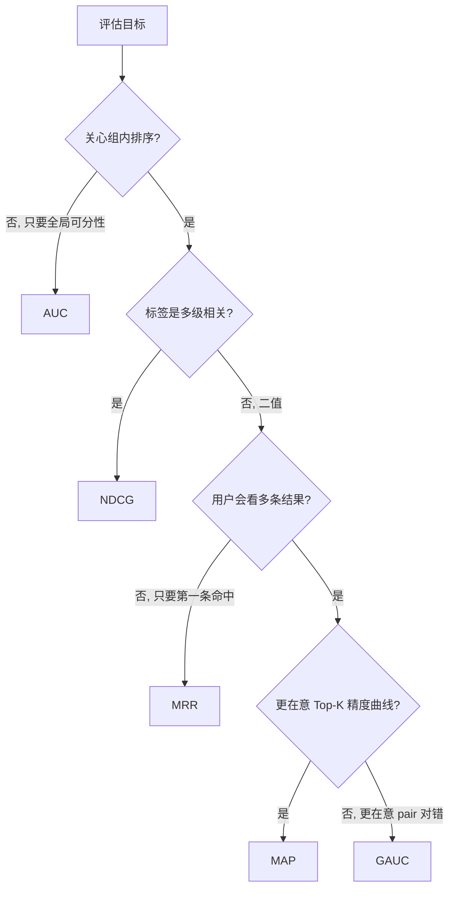

# 排序评估指标手册

> AUC · GAUC · NDCG · MAP · MRR
>
> 配套实现：`recsys/ranking_metrics.py`（第 6 章数值例可复现：`python recsys/ranking_metrics.py`）

本手册只做一件事：把五个常用排序指标从定义推到可计算的估计量，并写清**在哪一组里算、权重怎么加、什么时候能用、什么时候会骗人**。公式与代码使用同一套约定；数值以第 6 章贯通例为准。

---

## 0. 先问三个问题，再选指标

排序评估看起来像「打一个分数」，真正在比的是三件不同的事。

| 问题 | 含义 | 对应指标 |
|------|------|----------|
| 比较的原子是什么？ | 一对正负样本 / 一整条列表 / 第一个命中 | AUC、GAUC 是 **pair**；NDCG、MAP 是 **list**；MRR 是 **first-hit** |
| 在哪个范围内比？ | 全库混在一起，还是每个用户 / Query 内部比完再汇总 | 全局 AUC 跨组；GAUC / NDCG / MAP / MRR 默认 **组内** |
| 位置和相关性怎么加权？ | 排在第 1 和第 100 是否等价；5 分相关和 1 分相关是否等价 | AUC 不计绝对位置；NDCG 有折损且可多级相关；MAP / MRR 默认二值 |

推荐、搜索、广告的线上排序几乎都是 **给定用户（或 Query）之后，对候选列表重排**。因此：

- 只报一个全局 AUC，衡量的是「全库正负是否可分」，**不是**「每个用户看到的列表排得好不好」。
- 组内指标（GAUC / NDCG / MAP / MRR）才贴近线上分发。
- Top-K 产品必须再看带截断的 NDCG@K / MAP@K / MRR@K；AUC 对「第 1 名和第 50 名」不够敏感。



五个指标可以同时报，但**优化目标和报数口径必须先对齐**，否则会出现「AUC 涨了、NDCG 跌了、线上也跌了」。

---

## 1. 符号约定

对一次评估集合 \(\mathcal{D}\)，每条样本是 \((x, y, s, u)\)：

| 符号 | 含义 |
|------|------|
| \(y \in \{0,1\}\) 或 \(r \ge 0\) | 二值标签，或多级相关性（0, 1, 2, …） |
| \(s \in \mathbb{R}\) | 模型得分，越大越靠前 |
| \(u\) | 分组键：用户、Query、Session、请求 |
| \(n^+, n^-\) | 正、负样本数；\(n = n^+ + n^-\) |
| \(K\) | 截断位置；不写 \(K\) 表示用整列 |
| \(\pi(i)\) | 按 \(s\) 降序后的第 \(i\) 位（从 1 开始） |
| \(\mathbf{1}[\cdot]\) | 示性函数 |

**同分**：\(s_i = s_j\) 时，AUC / GAUC 记 0.5；NDCG / MAP / MRR 用稳定排序，不打散同分，避免评估抖动。

**空相关组**：某组没有任何 \(y>0\) 时，AUC / GAUC 无定义；NDCG / MAP / MRR 本手册默认 **跳过该组**（不进平均），并单独报覆盖率。把空相关组记 0 会系统性压低均值，两种口径不要混用。

---

## 2. AUC

### 2.1 它在度量什么

AUC（Area Under the ROC Curve）回答：

> 随机抽一个正样本和一个负样本，模型把正样本排在负样本前面的概率是多少？

它是 **全局、pair 级、位置无关** 的排序正确率。阈值怎么切都不进入公式——AUC 不评价校准，只评价序。

### 2.2 从 ROC 面积推到 Wilcoxon–Mann–Whitney

固定阈值 \(\tau\)，预测 \(\hat y = \mathbf{1}[s \ge \tau]\)：

\[
\mathrm{TPR}(\tau) = \frac{\#\{i: y_i=1, s_i \ge \tau\}}{n^+},\qquad
\mathrm{FPR}(\tau) = \frac{\#\{j: y_j=0, s_j \ge \tau\}}{n^-}
\]

\(\tau\) 从 \(+\infty\) 扫到 \(-\infty\)，点 \((\mathrm{FPR}, \mathrm{TPR})\) 画出 ROC。定义为

\[
\mathrm{AUC} = \int_{0}^{1} \mathrm{TPR} \, \mathrm{d}(\mathrm{FPR})
\]

把样本按 \(s\) 从高到低扫描，三种事件对应 ROC 上三种线段：

1. 碰到一个 **正样本**：TPR 增加 \(1/n^+\)，FPR 不动 → **竖线**，面积贡献 0。
2. 碰到一个 **负样本**：FPR 增加 \(1/n^-\)，TPR 不动 → **横线**。此时已经扫过的正样本数为 \(n^+_{>}(j)\)（得分严格高于该负样本），横线高度是 \(n^+_{>}(j)/n^+\)，面积贡献
   \[
   \frac{1}{n^-} \cdot \frac{n^+_{>}(j)}{n^+}
   \]
3. 碰到 **长度为 \(k^++k^-\) 的结**：ROC 走对角线，面积是梯形，等价于结内每个正负 pair 记 \(1/2\)。

把所有负样本的横线（及结的梯形）加起来：

\[
\mathrm{AUC}
= \frac{1}{n^+ n^-}
  \sum_{j: y_j=0} \Big( n^+_{>}(j) + \tfrac12 n^+_{=}(j) \Big)
\]

换成双重求和，得到 Mann–Whitney 形式——这就是可手算、可实现的定义：

\[
\boxed{
\widehat{\mathrm{AUC}}
= \frac{1}{n^+ n^-}
  \sum_{i: y_i=1} \sum_{j: y_j=0}
  \Big( \mathbf{1}[s_i > s_j] + \tfrac12 \mathbf{1}[s_i = s_j] \Big)
}
\]

概率写法：

\[
\mathrm{AUC}
= P(s^+ > s^-) + \tfrac12 P(s^+ = s^-)
\]

其中 \(s^+, s^-\) 独立取自正、负样本的得分。

### 2.3 \(O(n \log n)\) 计算：平均秩

对得分做 **升序平均秩**（结取 mid-rank，秩从 1 起），记正样本秩之和为 \(R^+\)。Mann–Whitney \(U\) 统计量

\[
U = R^+ - \frac{n^+(n^+ + 1)}{2}
\]

正好清掉「正样本之间互相占据的秩」，剩下的是「正样本胜过负样本」的 pair 数（结记 0.5）。因此

\[
\widehat{\mathrm{AUC}} = \frac{U}{n^+ n^-}
\]

这与双重循环逐 pair 计数代数等价，本仓库实现走这条路径。

**特例**：

- 完美序：所有正分高于所有负分 \(\Rightarrow \mathrm{AUC}=1\)
- 随机序：\(\mathbb{E}[\mathrm{AUC}]=1/2\)
- 完全反序：\(\mathrm{AUC}=0\)
- Gini 系数：\(\mathrm{Gini} = 2\,\mathrm{AUC}-1\)（信贷常用，和 AUC 一一对应）

### 2.4 分组方式

**不分组。** 全库所有正样本和所有负样本两两比较。用户 A 的正样本可以和用户 B 的负样本组成 pair——这是全局 AUC 和 GAUC 的本质差别。

### 2.5 加权逻辑

标准 AUC 对每个正负 pair **等权**。样本不均衡 **不直接改变** AUC 的期望（分母已是 \(n^+ n^-\)），但会改变方差：正样本极少时，AUC 由少数几个正样本的位次决定，抖动很大。

若给样本权重 \(w_i\)，加权 AUC 把 pair \((i,j)\) 的贡献改成 \(w_i w_j\)，再归一化。本手册默认不加权；业务上的「加权 AUC」不要和 GAUC 混名。

### 2.6 适用场景

- 二分类 CTR / CVR 的 **离线粗评**，看模型是否把点击排到未点击前面。
- 正负来自同一分布、评估目标就是全局可分性（风控、反作弊、内容安全）。
- 需要一个 **与阈值无关**、对类别比例不敏感的标量，方便不同实验对比。
- 作为 pairwise loss（如 BPR、AUC 代理损失）的对齐指标。

### 2.7 失效场景

| 失效模式 | 原因 |
|----------|------|
| 只有正类或只有负类 | 分母 \(n^+ n^-=0\)，无定义 |
| 精排列表质量 | 全局 pair 大量来自 **跨用户** 比较；头部用户、易分样本可以抬高 AUC，组内排序仍差 |
| Top-K 产品 | 把一个正样本从第 1 换到第 2（与另一个正样本交换）AUC 不变；与中间的负样本交换才变。对「第一屏」不够敏感 |
| 校准 / 出价 | 得分 0.51 与 0.99 只要序相同，AUC 相同；CPC/oCPX 需要 logloss、校准误差 |
| 结很多 | 预测几乎常数时 AUC 被拉向 0.5，看起来「不差」 |
| 把回归分当分类评 | 多级相关被压成 0/1 后，AUC 看不见「更相关应更靠前」 |

**典型错觉**：全库 AUC 0.75、分用户一看大量用户 AUC≈0.5。模型学会的是「活跃用户 vs 不活跃用户」「热门 item vs 冷门 item」，不是列表排序。

---

## 3. GAUC

### 3.1 它在度量什么

GAUC（Group AUC，工业界常叫 **用户 AUC / UAUC**）回答：

> 在每个用户（或 Query）**自己的候选集合里**，模型把该用户的正样本排到他自己的负样本前面的概率，再按用户加权平均。

Alibaba DIN（Zhou et al., KDD 2018）把曝光加权 GAUC 作为主离线指标，原因正是第 2.7 节：全局 AUC 会被跨用户可分性灌水。

### 3.2 推导：条件概率的混合

把 pair 限制在同一组 \(u\) 内。组 \(u\) 的 AUC 就是组内条件概率：

\[
\mathrm{AUC}_u
= P(s^+ > s^- \mid u) + \tfrac12 P(s^+ = s^- \mid u)
\]

有效组（同时有正、负）

\[
\mathcal{U}_{\mathrm{valid}}
= \{ u : n_u^+ \ge 1,\ n_u^- \ge 1 \}
\]

GAUC 是这些条件 AUC 的加权平均：

\[
\boxed{
\mathrm{GAUC}
= \frac{\displaystyle\sum_{u \in \mathcal{U}_{\mathrm{valid}}} w_u \, \mathrm{AUC}_u}
        {\displaystyle\sum_{u \in \mathcal{U}_{\mathrm{valid}}} w_u}
}
\]

它 **不是** 全局 AUC。全局 AUC 的 pair 集合是 \(\bigcup_u \mathrm{Pos}_u \times \bigcup_v \mathrm{Neg}_v\)；GAUC 只用 \(\bigcup_u (\mathrm{Pos}_u \times \mathrm{Neg}_u)\)。跨组 pair 被扔掉了。

何时二者接近：各组得分尺度相近、正负比例相近、且跨组序与组内序一致。何时差得远：模型主要在拟合用户基线（活跃度、历史 CTR）而不是 item 相对序。

### 3.3 分组方式

| 场景 | 分组键 \(u\) | 组内样本 |
|------|----------------|----------|
| 信息流 / 电商推荐 | `user_id`，更好是 `user_id × request_id` | 一次请求的曝光 |
| 搜索 | `query_id` 或 `query × user` | 该次 Query 的文档 |
| 广告 | `user × pvr` 或广告位请求 | 竞价前候选 |
| 序列推荐 | `user × session` | Session 内候选 |

**不要**用 item_id 分组（组内往往全正或全负）。**不要**先把所有用户的列表拼成一条长列表再算 AUC 并称之为 GAUC。

组太小：\(n_u=2\) 时 \(\mathrm{AUC}_u \in \{0, 0.5, 1\}\)，方差极大。工业上常丢掉 \(n_u\) 过小的组，或改用 pair 加权（见下）。

### 3.4 加权逻辑

\(w_u\) 决定「谁的排序错误更贵」。四种常用定义：

| 名称 | \(w_u\) | 含义 | 何时用 |
|------|---------|------|--------|
| uniform / UAUC | \(1\) | 每个有效用户一票 | 关心尾部用户体验、防大户垄断 |
| impression（DIN 默认） | \(n_u\) | 按曝光条数 | 和线上流量口径接近 |
| click | \(n_u^+\) | 按正样本数 | 认为有点击的用户 AUC 更可信 |
| pair | \(n_u^+ n_u^-\) | 按有效 pair 数 | 与 \(\mathrm{Var}(\widehat{\mathrm{AUC}}_u)\) 更匹配，大组更稳 |

本仓库 `gauc_score(..., weight=...)` 四种都实现。第 6 章会看到：**同一批数据，四种加权可以给出四个不同的数**。汇报 GAUC 必须写明权重，否则实验不可比。

**覆盖率必须一起报。** 只有正或只有负的组被丢弃。全曝光无点击的用户、全点击的极端用户不进均值。定义

\[
\mathrm{group\_coverage} = \frac{|\mathcal{U}_{\mathrm{valid}}|}{|\mathcal{U}|},\qquad
\mathrm{sample\_coverage} = \frac{\sum_{u \in \mathcal{U}_{\mathrm{valid}}} n_u}{n}
\]

覆盖率过低时，GAUC 只代表「既有正又有负的活跃用户」，不能外推到全站。

### 3.5 适用场景

- 推荐 / 广告 **精排、粗排** 的主离线指标，目标是用户内相对序。
- 全局 AUC 很高但分人群效果差、或模型可能在学用户基线时，用 GAUC 打假。
- 多兴趣、DIN/DIEN、序列模型：声称「建模用户兴趣」就必须在用户内验证。
- A/B 前的门禁：GAUC 与线上时长 / CTR 的相关，通常好于全局 AUC。

### 3.6 失效场景

| 失效模式 | 原因 |
|----------|------|
| 有效组太少 | 多数请求只有 1 次曝光，或全未点击 → 大量丢组 |
| 组内样本极少 | \(\mathrm{AUC}_u\) 是 0/1 噪声，加权平均仍可能被少数大组带跑 |
| 仍非 Top-K | 组内把正样本从第 1 换到第 10，只要仍高于所有负样本，GAUC 不变 |
| 加权口径偷偷改 | impression 改 pair，数字能差好几个点，不是效果变了 |
| 用 item 热度当组 | 热门 item 全是正样本，组被丢弃，指标失真 |
| 跨天拼接同一 user | 把多天、多场景混成一组，组内 pair 不再对应同一次排序 |

GAUC 解决的是「在哪比较」，**没有**解决「排在第几名更重要」。要位置敏感，用 NDCG / MAP / MRR。

---

## 4. NDCG

### 4.1 它在度量什么

NDCG（Normalized Discounted Cumulative Gain）回答：

> 这条列表从上往下看，累积到的「相关性增益」占理想列表的几成？越靠前的位置折扣越小；越相关的文档增益越大。

它是 **组内、list 级、位置敏感、支持多级相关** 的指标。搜索和推荐的精排最常用 NDCG@K。

### 4.2 从增益、折损到归一化：逐步推导

假设用户从上往下浏览。第 \(i\) 位的价值有两块：

1. **增益** \(g(r_i)\)：位置 \(i\) 的真实相关性带来多少收益。
2. **折损** \(d(i)\)：用户看到第 \(i\) 位的概率（或注意力）随位置下降。

未归一化的累积增益：

\[
\mathrm{DCG@}K = \sum_{i=1}^{K} g(r_{\pi(i)}) \, d(i)
\]

工业界与 sklearn / Kaggle 的默认（Burges, RankNet）是 **指数增益 + 对数折损**：

\[
g(r) = 2^{r} - 1,\qquad d(i) = \frac{1}{\log_2(i+1)}
\]

因此

\[
\boxed{
\mathrm{DCG@}K = \sum_{i=1}^{K} \frac{2^{r_{\pi(i)}} - 1}{\log_2(i+1)}
}
\]

位置 1：\(\log_2 2 = 1\)，**不折损**。位置 2：\(\log_2 3 \approx 1.585\)。对数下降慢于 \(1/i\)：第 10 名仍有约 29% 的位置 1 权重，所以 NDCG 对「第一屏之后」仍给分。

**线性增益** \(g(r)=r\) 是 Järvelin & Kekäläinen (2002) 的原始增益。二值标签 \(r\in\{0,1\}\) 时 \(2^r-1=r\)，两种增益 **数值相同**。多级相关时指数增益会强烈奖励把 3 分文档（增益 7）排到 1 分文档（增益 1）前面。

**另一处折损约定**（原论文）：\(d(1)=1,\ d(i)=1/\log_2(i)\ (i\ge 2)\)。则位置 2 也不折损。与 \(\log_2(i+1)\) **不相等**。对比实验必须写明。本手册与代码默认 \(\log_2(i+1)\)。

DCG 的量纲随列表里有多少高相关文档变化，Query 之间不能直接平均。用 **理想序**（按真实 \(r\) 降序，截断同样的 \(K\)）的 DCG 去除量纲：

\[
\mathrm{IDCG@}K = \sum_{i=1}^{K} \frac{g(r^{\downarrow}_i)}{\log_2(i+1)}
\]

\[
\boxed{
\mathrm{NDCG@}K = \frac{\mathrm{DCG@}K}{\mathrm{IDCG@}K}
\quad (\mathrm{IDCG@}K=0 \text{ 时本手册记 } 0)
}
\]

\(\mathrm{NDCG}\in[0,1]\)。完美序为 1；相关文档全在末尾则接近 0。

多组时 **先组内再平均**（等权，除非另设 Query 权重）：

\[
\mathrm{mean\ NDCG@}K = \frac{1}{|\mathcal{Q}_{\mathrm{valid}}|} \sum_{q} \mathrm{NDCG@}K_{q}
\]

**禁止**把不同用户的列表拼成一条长列表算一个 NDCG：位置 1 会变成「某个用户的第一条」，语义崩溃。

### 4.3 分组方式

与 GAUC 相同：Query / 用户 / 请求。NDCG 是单列表函数，**一组一条有序表**。

\(K\) 的选择就是产品形态：

- 搜索首屏：NDCG@5 / @10
- 信息流双列：NDCG@6 / @12
- 全列表诊断：不截断，或 K 取候选集大小

### 4.4 加权逻辑

三层权重，不要混：

1. **位置折损** \(1/\log_2(i+1)\)：组内已经加权。
2. **增益** \(2^r-1\) 或 \(r\)：相关性等级的加权。
3. **组间平均**：默认每 Query 等权。也可按曝光、按 Query 频次加权（要单独声明）。  
   注意：mean of ratios \(\frac{1}{Q}\sum \mathrm{DCG}_q/\mathrm{IDCG}_q\) ≠ ratio of means。标准 NDCG 是前者。

### 4.5 适用场景

- 搜索、精排、重排，标签是 **多级相关**（0–4 人工标注，或停留时长分桶）。
- 需要强调头部、但仍给后续位置一些分。
- 和 LambdaMART / RankNet / ListNet 等 listwise / pairwise+位置 学习目标对齐。
- 推荐里用播放完成率、停留秒数当 \(r\)，比强行二值化更合理。

### 4.6 失效场景

| 失效模式 | 原因 |
|----------|------|
| IDCG=0 | 该组无正增益；记 0 还是跳过会改变均值 |
| 二值标签却期望「多级」效果 | 指数增益退化为线性，NDCG 退化为「带对数折扣的命中」 |
| \(K\) 选错 | NDCG@3 与 NDCG@50 可以反向；要对齐线上曝光深度 |
| 对数折损过缓 | 用户其实只看前 3 条时，NDCG 仍在给第 20 名打分，优化方向偏「整体序」而非「首屏」 |
| 未标注文档当 \(r=0\) | 池偏置：模型排出未标注但其实相关的文档，会被当成错误 |
| 跨 Query 直接比 DCG | 没有除以 IDCG，相关文档多的 Query 永远分高 |

---

## 5. MAP

### 5.1 它在度量什么

MAP（Mean Average Precision）回答：

> 每个 Query 从高分往下扫，每命中一个相关文档就记一次 Precision@k，这些精度的平均有多高？再对 Query 取平均。

它是 **组内、list 级、位置敏感、二值相关** 的指标。MAP 同时惩罚「相关文档排得低」和「相关文档之间夹了太多无关文档」。

### 5.2 从 Precision@k 推到 AP，再到 MAP

二值相关 \(\mathrm{rel}(i)=\mathbf{1}[r_{\pi(i)}>0]\)。前 \(k\) 位精度：

\[
P@k = \frac{1}{k} \sum_{i=1}^{k} \mathrm{rel}(i)
\]

设该 Query 共有 \(R\) 个相关文档，按得分从高到低出现在位置 \(k_1 < k_2 < \cdots < k_{R'}\)（截断后可能 \(R'<R\)）。**只有命中相关文档的那些位置** 才进入平均：

\[
\mathrm{AP}
= \frac{1}{Z} \sum_{k=1}^{N} P@k \cdot \mathrm{rel}(k)
= \frac{1}{Z} \sum_{j=1}^{R'} \frac{j}{k_j}
\]

这不是随意平均，而是 **非插值 Precision–Recall 曲线下的面积**：每命中一个相关，Recall 增加 \(1/R\)（TREC 口径），对应矩形高度为当时的 \(P@k_j\)。

归一化常数 \(Z\) 有两派，必须写进评估方案：

| 口径 | \(Z\) | 效果 |
|------|--------|------|
| TREC / 本手册默认 `normalize='R'` | \(R\)（截断前相关总数） | 窗口外没排进来的相关文档，AP 被拉低 |
| `normalize='min_R_K'` | \(\min(R,K)\) | 只在 Top-K 内评，不因「库里还有相关」而惩罚 |

\[
\boxed{
\mathrm{AP@}K = \frac{1}{Z} \sum_{j=1}^{R'} \frac{j}{k_j},\qquad
\mathrm{MAP@}K = \frac{1}{|\mathcal{Q}_{\mathrm{valid}}|} \sum_{q} \mathrm{AP@}K_{q}
}
\]

无相关文档的 Query：本手册默认跳过。若记 AP=0，等于把不可答 Query 当成系统失败。

### 5.3 分组方式

标准 IR：按 Query。推荐里按用户或请求，与 NDCG 相同。MAP 是 Query 级指标，**先 AP 后平均**。

### 5.4 加权逻辑

- 组内：每个相关文档等权（都是 \(1/Z\)）；位置通过 \(j/k_j\) 进入——相关文档越靠前、前面夹的无关越少，贡献越大。
- 组间：Query 等权。高频头 Query 与长尾 Query 同一票。若要贴近流量，需按 Query 频次加权，并改名为 weighted MAP。
- **不支持多级相关**。3 分和 1 分在 MAP 里都是「相关」。要分级，用 NDCG，或把 MAP 改成 graded AP（非本手册默认）。

### 5.5 适用场景

- 搜索、问答、召回评估：相关 / 不相关标注清晰。
- 关心「相关文档是否整体靠前」，而不只是第一条。
- 召回阶段的 MAP@K / Recall@K 搭配：Recall 看有没有召回来，MAP 看召回集合内部的序。
- 论文与竞赛（TREC、不少推荐比赛）的标准榜指标。

### 5.6 失效场景

| 失效模式 | 原因 |
|----------|------|
| 多级相关被二值化 | 阈值怎么切会改变 MAP；丢掉「更相关应更靠前」 |
| \(R\) 极大或极小 | \(R=1\) 时 AP 退化成 RR；\(R\) 很大时 AP 接近「相关文档的平均精度」，对第一条不敏感 |
| TREC 与 min(R,K) 混用 | 同一系统 AP@10 能差一倍（见测试 `test_ap_trec_penalizes_missing`） |
| 未标注即不相关 | 与 NDCG 相同的池偏置 |
| 与 AUC 比绝对大小 | MAP 通常远小于 AUC，因为负样本插在相关文档前会直接打压 \(P@k\) |

---

## 6. MRR

### 6.1 它在度量什么

MRR（Mean Reciprocal Rank）回答：

> 第一条正确答案平均出现在第几名的倒数？

它是 **组内、first-hit、二值** 指标。只盯「第一个相关」，后面排得再好也不加分。

### 6.2 推导

对 Query \(q\)，令

\[
k_q^\star = \min\{ i : \mathrm{rel}(i)=1 \}
\]

若不存在（截断 \(K\) 内没命中），规定 \(k_q^\star=\infty\)，倒数取 0。定义 Reciprocal Rank：

\[
\mathrm{RR}_q = \frac{1}{k_q^\star},\qquad \infty^{-1}:=0
\]

\[
\boxed{
\mathrm{MRR@}K = \frac{1}{|\mathcal{Q}_{\mathrm{valid}}|} \sum_{q} \mathrm{RR}_q
}
\]

**期望解释**：若把「第一命中位置」看成离散随机变量，MRR 是 \(\mathbb{E}[1/k^\star]\)，不是 \(1/\mathbb{E}[k^\star]\)。后者是 harmonic / arithmetic 的差别：两个 Query 分别第 1、第 100 名命中，MRR=\((1+0.01)/2=0.505\)，而 \(1/\mathrm{mean}(k^\star)=1/50.5\approx 0.02\)。不要用平均排名的倒数代替 MRR。

RR 与 AP 的关系：当 \(R=1\) 时 \(\mathrm{AP}=\mathrm{RR}\)。多个相关文档时，MRR 扔掉了第一条之后的全部信息。

### 6.3 分组方式

按 Query / 用户 / 会话。已知项检索（known-item）、下一跳预测、点击位置评估，一组通常只有 **一个** 真值。

### 6.4 加权逻辑

- 组内：只有第一命中有权重 \(1/k^\star\)，其余相关权重为 0。
- 组间：Query 等权。可按流量加权，需声明。
- 截断：MRR@K 在 \(k^\star>K\) 时记 0，强调「K 以内必须打中」。

### 6.5 适用场景

- 搜索「导航类 Query」（用户心里只有一个目标页）。
- 问答、槽位填充、已知项检索。
- 序列推荐「下一件商品 / 下一首歌」，ground truth 通常一条。
- 召回 HitRate / Recall@K 的补充：HitRate 只问进没进 K，MRR 还问进了排第几。

### 6.6 失效场景

| 失效模式 | 原因 |
|----------|------|
| 信息流、多目标列表 | 用户会消费多条；只优化第一条会牺牲列表多样性与后续 CTR |
| 多相关文档 | 两条系统第一命中同位置，MAP/NDCG 可以差一截，MRR 完全一样 |
| 指标饱和 | 绝大多数 Query 已经第 1 命中，MRR→1，分不出 SOTA |
| 用平均排名冒充 | 见 6.2，数值可以差一个数量级 |
| 二值化多级标注 | 把「勉强相关」也当第一命中，RR 虚高 |

---

## 7. 贯通数值例（手算）

同一批数据贯穿五个指标，用来看 **分组和加权如何改写结论**。不要跳过这一节直接看表。

### 7.1 数据

两个用户，按预测分 **降序** 写下（这已经是模型给出的列表）。

**用户 A**（6 条，2 正 4 负）

| 位次 \(i\) | 1 | 2 | 3 | 4 | 5 | 6 |
|------------|---|---|---|---|---|---|
| \(s\) | 0.9 | 0.8 | 0.7 | 0.4 | 0.3 | 0.1 |
| \(y\) | 1 | 0 | 1 | 0 | 0 | 0 |

**用户 B**（3 条，1 正 2 负）

| 位次 \(i\) | 1 | 2 | 3 |
|------------|---|---|---|
| \(s\) | 0.95 | 0.6 | 0.2 |
| \(y\) | 0 | 1 | 0 |

### 7.2 组内 AUC

用户 A：正分 \(\{0.9, 0.7\}\)，负分 \(\{0.8, 0.4, 0.3, 0.1\}\)，共 \(2\times 4=8\) 对。

- \(0.9\) 对四个负分全胜 → 4
- \(0.7\) 负于 \(0.8\)，胜其余 3 个 → 3

\[
\mathrm{AUC}_A = \frac{7}{8} = 0.875
\]

用户 B：正分 \(\{0.6\}\)，负分 \(\{0.95, 0.2\}\)。

- \(0.6 < 0.95\)，\(0.6 > 0.2\) → 1 胜 1 负

\[
\mathrm{AUC}_B = \frac{1}{2} = 0.5
\]

### 7.3 全局 AUC ≠ GAUC

全库正分 \(\{0.9, 0.7, 0.6\}\)，负分 \(\{0.8, 0.4, 0.3, 0.1, 0.95, 0.2\}\)，\(3\times 6=18\) 对（含跨用户 pair）。

| 正分 | 胜过的负分个数 |
|------|----------------|
| 0.9 | 5（只负于 0.95） |
| 0.7 | 4（负于 0.8 与 0.95） |
| 0.6 | 4（负于 0.8 与 0.95） |

\[
\mathrm{AUC}_{\mathrm{global}} = \frac{13}{18} \approx 0.7222
\]

跨用户 pair 例子：A 的正样本 0.9 胜过 B 的负样本 0.2，这与「B 的列表排得好不好」无关，却抬了全局 AUC。

### 7.4 四种 GAUC 加权

\[
\begin{aligned}
\mathrm{GAUC}_{\mathrm{uniform}}
&= \frac{7/8 + 1/2}{2} = \frac{11}{16} = 0.6875 \\[4pt]
\mathrm{GAUC}_{\mathrm{impression}}
&= \frac{6\cdot(7/8) + 3\cdot(1/2)}{9} = \frac{3}{4} = 0.75 \\[4pt]
\mathrm{GAUC}_{\mathrm{click}}
&= \frac{2\cdot(7/8) + 1\cdot(1/2)}{3} = \frac{3}{4} = 0.75 \\[4pt]
\mathrm{GAUC}_{\mathrm{pair}}
&= \frac{(2\cdot 4)\cdot(7/8) + (1\cdot 2)\cdot(1/2)}{8+2} = \frac{4}{5} = 0.80
\end{aligned}
\]

同一模型、同一天数据：0.69 / 0.75 / 0.80。**不写权重的 GAUC 无法复现。**  
pair 加权把话语权给了 pair 更多的用户 A，所以最高；uniform 给 B 与 A 相同票，所以最低。

### 7.5 NDCG（二值，\(g(r)=2^r-1=r\)）

用户 A：相关在第 1、第 3 位。

\[
\mathrm{DCG}_A = \frac{1}{\log_2 2} + \frac{1}{\log_2 4} = 1 + \frac12 = 1.5
\]

理想序是相关占第 1、第 2 位：

\[
\mathrm{IDCG}_A = 1 + \frac{1}{\log_2 3},\qquad
\mathrm{NDCG}_A = \frac{1.5}{1 + 1/\log_2 3} \approx 0.9197
\]

用户 B：相关在第 2 位。

\[
\mathrm{DCG}_B = \frac{1}{\log_2 3},\quad \mathrm{IDCG}_B = 1,\quad
\mathrm{NDCG}_B \approx 0.6309
\]

等权 mean NDCG \(\approx 0.7753\)。

### 7.6 MAP

用户 A：相关位次 \(k_1=1, k_2=3\)，\(R=2\)。

\[
P@1=1,\quad P@3=\frac{2}{3},\qquad
\mathrm{AP}_A = \frac{1 + 2/3}{2} = \frac{5}{6} \approx 0.8333
\]

用户 B：\(k_1=2\)，\(R=1\)。

\[
\mathrm{AP}_B = \frac{1/2}{1} = 0.5
\]

\[
\mathrm{MAP} = \frac{5/6 + 1/2}{2} = \frac{2}{3} \approx 0.6667
\]

### 7.7 MRR

\[
\mathrm{RR}_A = \frac{1}{1}=1,\quad
\mathrm{RR}_B = \frac{1}{2}=0.5,\quad
\mathrm{MRR} = 0.75
\]

用户 A 的第二个相关文档（第 3 位）进入了 AP / NDCG，**完全不进入 MRR**。

### 7.8 一张表看完

| 指标 | 用户 A | 用户 B | 汇总 | 汇总口径 |
|------|--------|--------|------|----------|
| AUC | 0.875 | 0.500 | 0.722 | 全局 pair，跨用户 |
| GAUC-uniform | 0.875 | 0.500 | 0.688 | 有效用户等权 |
| GAUC-impression | 0.875 | 0.500 | 0.750 | 按曝光 |
| GAUC-pair | 0.875 | 0.500 | 0.800 | 按正负 pair 数 |
| NDCG | 0.920 | 0.631 | 0.775 | 组内再等权 |
| AP / MAP | 0.833 | 0.500 | 0.667 | 组内再等权 |
| RR / MRR | 1.000 | 0.500 | 0.750 | 只看第一命中 |

结论：

1. 全局 AUC（0.72）既不等于 impression-GAUC（0.75），也不等于 uniform-GAUC（0.69）。
2. MRR（0.75）高于 MAP（0.67）：A 的第一条就是命中，MRR 给满分，MAP 还要为第 3 位那个相关文档打折。
3. NDCG 最高（0.78 附近），因为对数折损对第 3 位仍然温和。

复现：

```bash
python recsys/ranking_metrics.py
python recsys/test_ranking_metrics.py
```

---

## 8. 总表：分组、加权、适用、失效

| | AUC | GAUC | NDCG | MAP | MRR |
|--|-----|------|------|-----|-----|
| 比较原子 | 正负 pair | 组内 pair | 整列 | 整列 | 第一命中 |
| 分组 | 无（全局） | 用户 / Query / 请求 | 同左 | 同左 | 同左 |
| 组内加权 | pair 等权 | 折损=1 | \(g(r)/log_2(i+1)\) | 相关位 \(P@k\) | \(1/k^\star\) |
| 组间加权 | — | uniform / 曝光 / 点击 / pair | 默认 Query 等权 | 默认 Query 等权 | 默认 Query 等权 |
| 标签 | 二值 | 二值 | 二值或多级 | 二值 | 二值 |
| 位置敏感 | 否（只比相对序） | 否 | 是，对数折损 | 是，通过 \(P@k\) | 是，只第一处 |
| 值域 | [0,1]，随机 0.5 | 同左 | [0,1]，随机视 \(R\) 而定 | [0,1] | [0,1] |
| 无正/无负 | 无定义 | 丢弃该组 | 无正则 0 或跳过 | 同左 | 同左 |
| 主战场 | CTR 粗评、风控 | 推荐/广告精排 | 搜索/精排/重排 | 搜索/召回 | 下一跳、已知项 |
| 典型失效 | 跨用户灌水、非 Top-K | 丢组、仍非 Top-K | \(K\) 与折损不匹配 | 多级相关、口径混用 | 多相关列表、饱和 |

### 8.1 和线上指标的经验对齐

| 产品 | 较稳的离线组合 | 单独用往往翻车 |
|------|----------------|----------------|
| 信息流推荐 | GAUC + NDCG@K + 分桶校准 | 只有全局 AUC |
| 电商搜索 | NDCG@10 + MAP@10 | 只有 MRR（多相关被丢掉） |
| 广告 CTR | GAUC + logloss / ECE | 只有 AUC（出价需要对准） |
| 召回 | Recall@K + MRR/MAP | 只有 AUC（召回不是全库 pair 分类） |
| 下一首/下一品 | MRR@K + HitRate@K | 只有 NDCG@50（用户根本看不到第 50） |

---

## 9. 选型清单

按优先级往下问，问到能定口径为止。

1. **线上是不是「给定 u 再排一个列表」？**  
   是 → 主指标必须组内（GAUC 或 NDCG/MAP/MRR）。全局 AUC 只能当辅指标。
2. **标注是多级还是点击二值？**  
   多级 → NDCG。二值 → 看第 3 问。
3. **用户会认真看几条？**  
   一条（跳转、下一首）→ MRR。一屏多条 → NDCG@K 或 MAP@K。整列相对序、没有明确 K → GAUC。
4. **要不要强调「相关文档一个都不能漏」？**  
   要，且相关集合已知 → MAP 用 TREC 的 \(Z=R\)。只评第一屏 → \(Z=\min(R,K)\) 或 NDCG@K。
5. **大户能不能代表整体？**  
   要防大户 → GAUC-uniform 或 Query 等权 NDCG。要对齐流量 → impression 加权。
6. **报数时附上什么？**  
   至少：分组键、K、增益/折损、GAUC 权重、空相关组是跳过还是记 0、覆盖率、样本数。

### 9.1 反向选择：你已经在优化某个 loss 时

| 训练目标 | 应对齐的离线指标 |
|----------|------------------|
| Logloss / BCE | AUC **不能**单独过门；加 logloss 与校准 |
| BPR / pairwise AUC 代理 | AUC、GAUC |
| LambdaMART / LambdaLoss | NDCG@K |
| ListNet / softmax cross-entropy | NDCG、MAP |
| Sampled softmax 召回 | Recall@K、MRR、MAP，而不是全库 AUC |

---

## 10. 工程实现要点

与 `recsys/ranking_metrics.py` 对齐的约定：

1. **AUC**：平均秩 Mann–Whitney，结 = 0.5；单类抛 `MetricUndefinedError`。
2. **GAUC**：无效组丢弃；返回 `gauc`、`group_coverage`、`sample_coverage`、各组明细。
3. **NDCG**：`gain='exp'` 为 \(2^r-1\)，`linear` 为 \(r\)；折损 \(\log_2(i+1)\)；IDCG=0 → 0。
4. **MAP**：默认 TREC \(Z=R\)；可选 `min_R_K`。
5. **MRR**：截断内无命中 → 0。
6. **同分**：NDCG/MAP/MRR 稳定排序，不随机打结。
7. **切勿**用「先按 user 算再对 AUC 取 `np.nanmean`」却不声明 NaN 来自无效组——那就是 GAUC-uniform，不是全局 AUC。
8. **大数据**：AUC/GAUC 不要 \(O(n^+ n^-)\) 双重循环；用秩统计。组内 NDCG/MAP 对每组 \(O(n_u \log n_u)\)。

最小调用：

```python
from recsys.ranking_metrics import (
    roc_auc_score, gauc_score, mean_ndcg,
    mean_average_precision, mean_reciprocal_rank,
)

roc_auc_score(y, s)
gauc_score(y, s, user_id, weight="impression")["gauc"]
mean_ndcg(y, s, user_id, k=10, gain="exp")["ndcg"]
mean_average_precision(y, s, user_id, k=10)["map"]
mean_reciprocal_rank(y, s, user_id, k=10)["mrr"]
```

---

## 11. 公式速查

\[
\begin{aligned}
\widehat{\mathrm{AUC}}
&= \frac{1}{n^+ n^-}\sum_{y_i=1}\sum_{y_j=0}
   \big(\mathbf{1}[s_i>s_j]+\tfrac12\mathbf{1}[s_i=s_j]\big) \\[6pt]
\mathrm{GAUC}
&= \frac{\sum_u w_u \mathrm{AUC}_u}{\sum_u w_u},\quad
   u\in\mathcal{U}_{\mathrm{valid}} \\[6pt]
\mathrm{DCG@}K
&= \sum_{i=1}^{K}\frac{2^{r_{\pi(i)}}-1}{\log_2(i+1)},\quad
\mathrm{NDCG@}K=\mathrm{DCG}/\mathrm{IDCG} \\[6pt]
\mathrm{AP@}K
&= \frac{1}{Z}\sum_{j=1}^{R'}\frac{j}{k_j},\quad
\mathrm{MAP}=\mathrm{mean}_q(\mathrm{AP}_q) \\[6pt]
\mathrm{RR}_q
&= 1/k_q^\star,\quad
\mathrm{MRR}=\mathrm{mean}_q(\mathrm{RR}_q)
\end{aligned}
\]

---

## 参考文献（定义来源）

- Fawcett, T. *An introduction to ROC analysis*. Pattern Recognition Letters, 2006.（AUC / ROC）
- Hanley & McNeil. *The meaning and use of the area under a ROC curve*. Radiology, 1982.（与 Wilcoxon 的关系）
- Zhou et al. *Deep Interest Network for Click-Through Rate Prediction*. KDD, 2018.（曝光加权 GAUC）
- Järvelin & Kekäläinen. *Cumulated gain-based evaluation of IR techniques*. TOIS, 2002.（DCG 原定义）
- Burges et al. *Learning to Rank using Gradient Descent*. ICML, 2005.（\(2^r-1\) 与 \(\log_2(i+1)\)）
- Manning, Raghavan, Schütze. *Introduction to Information Retrieval*, Ch.8.（AP / MAP / RR 的 IR 标准口径）
- Voorhees & Harman. TREC 评测实践。（AP 用 \(Z=R\)）
